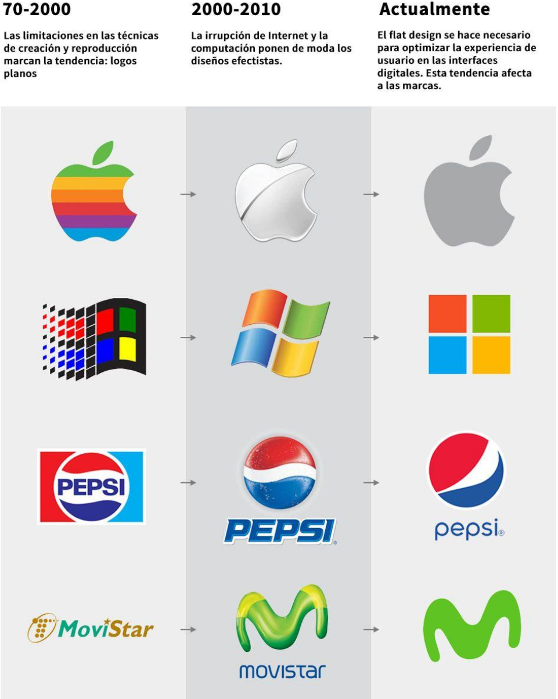

## Evolucíón del Diseño Web {#evolution}

### Años 90: El Inicio de la Web {#90s}

El __diseño web__ comenzó de __forma básica__ con __páginas estáticas__, __texto plano__ y
__limitaciones técnicas__.

!!! success "La primera Web"
    Se publicó la primera versión del __HTML__ que solo permitía lo __esencial__, con __poca estática__ y __funcionalidad__.

    En __1991__ surge la [__primera página web__](http://line-mode.cern.ch/www/hypertext/WWW/TheProject.html) de la __historia__ que aún es __accesible hoy en día__ .

<figure markdown>
{width=600px .rounded}
<figcaption>Primera Página Web de la Historia, WWW</figcaption>
</figure>

!!! question "¿Quién la creo?"
    Era parte de un proyecto para el __CERN__ y estaba destinada a __explicar__ los __fundamentos__ de lo que él llamó la __World Wide Web (WWW)__.

Su contenido __describía qué era la web__, cómo se podía __acceder a documentos__ y cómo __crear páginas__ propias __utilizando HTML__. 

---

### Años 2000s: La Aparición del CSS {#2000s}

!!! abstract "Todo más bonito"
    La llegada del CSS permitió __separar el contenido__ de la presentación, mejorando el 
    __diseño visual__.

    Aparecen __tablas y marcos__ para organizar la información.

!!! success "Animaciones"
    Empezo a usarse __Flash__, que permitio introducir __animaciones__ y __elementos interactivos__.

---

### Mediados de Los 2000s: La Web 2.0 {#half-2000s}

La web se vuelve cada vez más __dinámica__ e __interactiva__. A continuación se destacan los puntos principales:

- :material-account-circle-outline:{ .lg .middle } **Diseño centrado en el usuario**

    ---
    Uso de __botones__, __formularios__ y __navegación intuitiva__.

- :material-gesture-tap-button:{ .lg .middle } **Interactividad creciente**

    ---
    Interfaces más __responsivas__ y adaptadas al __comportamiento__ del __usuario__.

- :material-account-group-outline:{ .lg .middle } **Contenido generado por usuarios (UGC)**
  
    ---
    __Comentarios__, __publicaciones__ y __participación activa__.

- :material-share-variant:{ .lg .middle } **Impacto de las redes sociales**

    ---
    Mayor __personalización__ del contenido presentado al usuario.

!!! info "Web 2.0"
    La combinación de __interactividad__ y __personalización__ está definiendo la experiencia __digital moderna__.

---

### Años 2010s: El Diseño Responsivo {#2010s}

- Con el __auge__ de los __dispositivos móviles__(1), surge el __diseño responsive__, que
permite que las __páginas web__ se __adapten__ a distintos __tamaños de pantalla__.
{.annotate}

    1. Tambien se creo el __Mobile First__ (__En Telefono Mobil Primero__), pero __no__ se __generalizo__ hasta __2018__. 

!!! success
    HTML5 y CSS3 __revolucionan__ con nuevas __capacidades gráficas__ y __multimedia__.
  
---

### Actualidad: Minimalismo y UX {#now}

El __enfoque actual__ está en:

- La __simplicidad__ :material-sticker-text-outline:
- La __velocidad__    :simple-speedtest:
- La __accesibilidad__ :material-wheelchair-accessibility:
!!! warning annotate "OJITO"
    Se prioriza la __experiencia de usuario__ (UX) y la __optimización para móviles__. __Frameworks__(1) como [__Bootstrap__](https://getbootstrap.com/) y el uso de __tecnologías__ como __JavaScript__ mejoran la __interactividad__ y la __personalización__.

  1. Un __framework__ es una __estructura__ o __conjunto de herramientas__, __bibliotecas__ y __convenciones predefinidas__ que __simplifican__ y __aceleran__ el __desarrollo__ de __software__. 

---

### El Futuro: La IA y Web 3.0 {#future}

!!! abstract annotate "Nuevas Técnologias"
    Se espera que la __IA__, el __aprendizaje automático__(1) y las __tecnologías inmersivas__ (AR/VR) jueguen un __papel clave__, transformando la manera en que __interactuamos__ con las __interfaces web__.

  1. Con __IAs__ generativas, o el uso del __Deep Learning__

---

### La Evolucion de los Logotipos {#logos}

<figure markdown>
{ width="800px" .rounded}
<figcaption>Muy Pasado, Menos Pasado y Actualidad</figcaption>
</figure>

??? question "¿Veís algun patrón?"
     __¡Así es!__ al comienzo, eran todos __muy simples__, después __sufrieron un intento__ de __asemejarse a la realidad__, y por último de vuelta a la __simplicidad__.

## Interacción Persona-Ordenador {#pc-human}

## Elementos de las Interfaces Gráficas {#ui-elements}

## Elementos de una Interfaz Web {#ui-web-elements}

## Componentes de una Interfaz Web {#ui-web-components}

## Guías de Estilo {#styles-sheet}

## Mapas Conceptuales y Mapas de Navegación {#conceptual-maps-and-nav-maps}

## Prototipos Web {#prototypes}